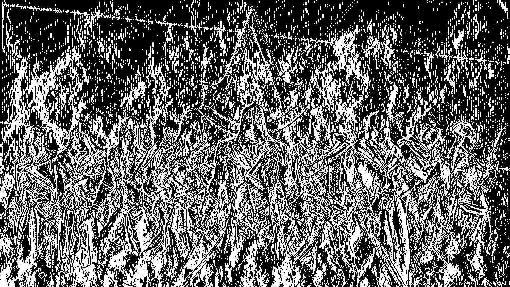
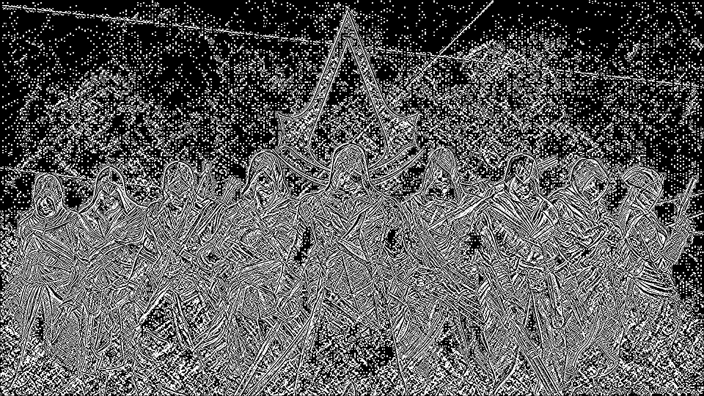
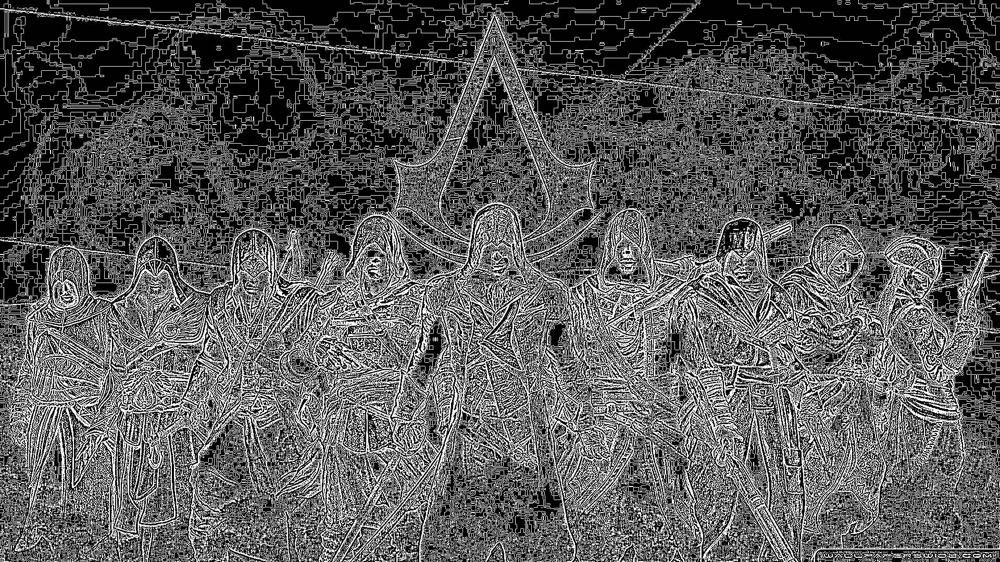

# Edge-Detection
## Aim:
To perform edge detection using Sobel, Laplacian, and Canny edge detectors.

## Software Required:
Anaconda - Python 3.7

## Algorithm:
### Step1:
<br>
Import the necessary modules.

### Step2:
<br>
Load the image to operate on.

### Step3:
<br>
Convert the image to grayscale image.

### Step4:
<br>
Use Sobel operator along x,y and xy directions.

### Step5:
<br>
Operate the image using Laplacian operator.

### Step6:
<br>
Operate the image using Canny Edge operator.

### Step7:
<br>
Show all the operated images output.

## Program:

``` Python
# Import the packages
import cv2
import numpy as np
import matplotlib.pyplot as plt


# Load the image, Convert to grayscale and remove noise
image1=cv2.imread ('AC.jpg') 
gray_image = cv2.cvtColor(image1,cv2.COLOR_BGR2GRAY)

cv2.imshow('Gray',gray_image)


# SOBEL EDGE DETECTOR
img = cv2.GaussianBlur(gray_image,(3,3),0)
sobelx = cv2.Sobel(gray_image,cv2.CV_64F,1,0,ksize=5)
sobely = cv2.Sobel(gray_image,cv2.CV_64F,0,1,ksize=5)
sobelxy =cv2.Sobel(gray_image,cv2.CV_64F,1,1,ksize=5)
cv2.imshow('Sobel X',sobelx)
cv2.imshow('Sobel Y',sobely)
cv2.imshow('Sobel XY',sobelxy)


# LAPLACIAN EDGE DETECTOR
laplacian=cv2.Laplacian(img,cv2.CV_64F)
cv2.imshow('Laplacian',laplacian)


# CANNY EDGE DETECTOR
canny_edges = cv2.Canny(gray_image, 120, 150)
cv2.imshow('Canny Edges',canny_edges)

cv2.waitKey(0)
cv2.destroyAllWindows()


```
## Output:

### ORIGINAL IMAGE


### GRAYSCALE IMAGE


### SOBEL EDGE DETECTOR





### LAPLACIAN EDGE DETECTOR


### CANNY EDGE DETECTOR


## Result:
Thus the edges are detected using Sobel, Laplacian, and Canny edge detectors.
